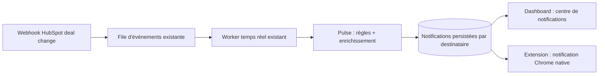

# Plan — Jarvis Pulse : notifications temps réel sur les changements de deals

## Objectif

Permettre aux admins et managers d'une organisation d'être prévenus rapidement quand un deal HubSpot évolue : changement de probabilité de closing, de montant, de stage, de date de closing, d'owner ou de pipeline. Deux canaux en v1 : notification Chrome native via l'extension, et centre de notifications complet dans le dashboard manager. L'email est explicitement hors scope v1 (prévu en phase ultérieure).

## Point de départ (existant à réutiliser)

- Les webhooks HubSpot sont déjà en place et capturent déjà les changements de propriétés deals pertinents (montant, stage, probabilité, date de closing, owner, pipeline), avec signature vérifiée, file d'événements persistée et worker de traitement temps réel.
- Les rôles applicatifs `sales` / `manager` / `admin` existent déjà côté auth.
- Jarvis Pulse est donc essentiellement une **couche de transformation et de livraison** branchée sur ce flux d'événements existant, pas une nouvelle ingestion.

## Architecture fonctionnelle

## Comportement détaillé

### 1. Génération des notifications (backend)

- À chaque événement de changement de propriété deal traité par le worker existant, Pulse détermine s'il s'agit d'un des cinq types d'événements suivis :
  1. Changement de probabilité de closing
  2. Changement de montant
  3. Changement de stage
  4. Changement de date de closing
  5. Changement d'owner ou de pipeline
- Pour chaque événement retenu, Pulse construit un message lisible incluant : nom du deal, type de changement, **valeur avant → valeur après**, et horodatage. L'ancienne valeur est récupérée depuis la donnée déjà synchronisée en base (ou depuis le payload webhook quand il la fournit).
- Pulse identifie les destinataires : tous les utilisateurs de l'organisation avec rôle `admin` ou `manager`, filtrés selon leurs préférences individuelles (voir section 3).
- Une notification persistée est créée **par destinataire**, avec état lu/non-lu, dans Supabase, sous protection RLS (un utilisateur ne voit que ses propres notifications, dans son org).
- Déduplication : un même événement webhook ne doit jamais produire deux fois la même notification pour le même destinataire (idempotence basée sur l'identifiant d'événement déjà présent dans la file).

### 2. Livraison aux clients (quasi temps réel)

- Le dashboard et l'extension interrogent le backend à intervalle court (~30-60 s) pour récupérer les notifications non lues. Pas de canal push en v1 : le webhook HubSpot garantit déjà la fraîcheur côté serveur, le polling court suffit côté client.
- **Extension Chrome** : le service worker de l'extension programme une vérification périodique (mécanisme d'alarme du navigateur) et affiche une notification Chrome native pour chaque nouvelle notification non encore présentée. Nécessite l'ajout de la permission notifications (et alarmes) au manifest. Un clic sur la notification ouvre le panneau Jarvis. L'extension marque localement ce qui a déjà été affiché pour éviter les doublons à chaque cycle.
- **Dashboard** : une cloche avec badge de compteur non-lu, ouvrant un centre de notifications : flux chronologique, distinction lu/non-lu, marquage individuel et "tout marquer comme lu", historique paginé.

### 3. Préférences utilisateur

- Chaque admin/manager dispose d'un réglage Pulse dans le dashboard : activation/désactivation **par type d'événement** (les cinq types listés ci-dessus), plus un interrupteur global Pulse on/off.
- Pas de seuils en v1 (volontairement écarté) ; le modèle de préférences doit cependant rester extensible pour en ajouter plus tard.
- Valeurs par défaut : tout activé.
- Les préférences sont stockées en base et appliquées **au moment de la génération** : si un type est désactivé, la notification n'est pas créée pour ce destinataire.

### 4. API exposée

Nouveaux points d'entrée, tous authentifiés, réservés aux rôles admin/manager, et respectant le format de réponse standard du projet (`success` / `data` / `error`) :

- Lister les notifications (paginé, filtrable lu/non-lu) + compteur de non-lues
- Marquer une notification comme lue / tout marquer comme lu
- Lire et mettre à jour les préférences Pulse de l'utilisateur courant

### 5. Données et rétention

- Nouvelle(s) table(s) Supabase : notifications par destinataire (avec type d'événement, payload résumé, référence au deal, état lu/non-lu) et préférences Pulse par utilisateur. Migration SQL avec RLS dès la création.
- Rétention : purge automatique des notifications anciennes (ex. > 90 jours) pour éviter une croissance illimitée — simple tâche de nettoyage.
- RGPD : les notifications contiennent des données de deals (montants, noms) déjà présentes en base ; pas de nouvelle catégorie de données personnelles. La purge de rétention couvre le besoin d'effacement.

## Hors scope v1 (explicite)

- Email (phase 2, fournisseur à choisir plus tard)
- Seuils configurables (variation minimale de proba/montant)
- Notifications pour les sales sur leurs propres deals
- Push temps réel strict (Supabase Realtime / SSE)
- Notification spécifique "deal gagné/perdu" comme type distinct (couvert indirectement par le changement de stage)

## Découpage de livraison suggéré

1. **Backend Pulse** : schéma + génération des notifications depuis le worker webhook existant + API de lecture/marquage + préférences. Testable seul via l'API.
2. **Dashboard** : cloche, badge, centre de notifications, page de préférences.
3. **Extension** : permission notifications + alarme périodique + notifications Chrome natives.

## Critères d'acceptation

1. Un changement de stage/montant/proba/date/owner sur un deal HubSpot produit une notification visible dans le dashboard en moins d'une minute.
2. La notification affiche le deal et la transition avant → après.
3. Une notification Chrome native apparaît sur le poste où l'extension est installée et connectée.
4. Un admin peut désactiver un type d'événement et ne plus rien recevoir pour ce type.
5. Un utilisateur `sales` ne voit aucune notification Pulse et ne peut pas appeler les endpoints.
6. Aucun doublon de notification pour un même événement webhook.
