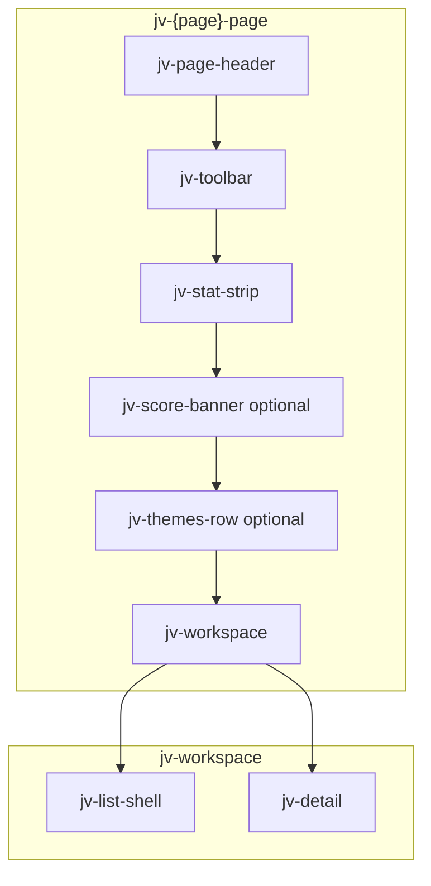

# Jarvis — Design System & Page Template

> **Objectif de ce document**  
> Spécification unique pour qu’un LLM (ou un humain) puisse **créer ou migrer n’importe quelle page** du dashboard Jarvis en conservant exactement le même langage visuel que la page **Appels** (`JarvisCallIntelligencePage` / `CallsView`).  
> Référence d’implémentation : `apps/extension/src/components/dashboard/calls/CallsView.tsx` + `apps/extension/src/components/styles/calls.css`.  
> Références preview : `design-preview/magicpath-calls/`, `design-preview/magicpath-overview/`.

---

## 1. Philosophie visuelle

### 1.1 Nom interne

**« Thin warm stone »** — interface légère, fond pierre chaude, surfaces blanches fines, accents terra discrets.

### 1.2 Principes non négociables

| Principe | Règle |
|---|---|
| Densité | Informative mais aérée. Pas de cartes épaisses, pas de gros ombrages. |
| Hiérarchie | Titre page léger → KPI strip → insights thématiques → workspace master-detail. |
| Couleur | 90 % neutre stone. La couleur signifie quelque chose (statut, direction, risque, IA). |
| Typo | DM Sans. Titres KPI en `font-weight: 300`. Corps en 400–500. |
| Formes | Coins `14px` pour panneaux, `999px` pour pills/boutons, `10px` pour callouts. |
| Bordures | `1px` quasi invisibles `rgba(28,25,23,0.08)`. Séparateurs internes plus légers `0.06`. |
| Motion | Entrées douces spring. Micro-translations au hover. Respect `prefers-reduced-motion`. |
| IA | Icône `Sparkles` + bouton primaire ou callout dashed terra. Jamais de gradient criard. |

### 1.3 Ce qu’on ne fait PAS

- Pas de Tailwind inline pour les couleurs (sauf preview isolé). Utiliser les classes `jv-*` et les tokens CSS.
- Pas de `font-weight: 650+` sur les titres de page (réservé à l’ancien système `ae-*`).
- Pas de pastilles d’icônes colorées dans les KPI (icône outline terra, ou pas d’icône).
- Pas de tables denses type Excel sans reprendre le pattern liste `jv-list-item`.
- Pas de panneau détail sans état vide `jv-detail-empty`.

---

## 2. Tokens de design (`--jv-*`)

Déclarer sur le **wrapper racine de la page** (ex. `.jv-calls-page`, `.jv-overview-page`) ou sur `:root` si stylesheet global.

```css
--jv-bg: #f4f3f0;                          /* Canvas app (hors page) */
--jv-surface: #ffffff;                       /* Cartes, listes, détail */
--jv-surface-muted: #f8f7f4;                 /* Pills inactives, fond transcript */
--jv-text: #1c1917;                          /* Titres, valeurs KPI */
--jv-text-soft: #44403c;                     /* Prose, items de liste */
--jv-muted: #57534e;                         /* Labels, sous-titres */
--jv-faint: #a8a29e;                         /* Captions, compteurs, kickers */
--jv-border: rgba(28, 25, 23, 0.08);
--jv-border-strong: rgba(28, 25, 23, 0.14);
--jv-terra: #d4714a;                         /* Accent principal, icône page, bullets */
--jv-terra-soft: rgba(212, 113, 74, 0.14);   /* Sélection liste, callout bg implicite */
--jv-success: #2d8a5e;
--jv-warning: #c47d1a;
--jv-danger: #c4453a;
--jv-cta: #1c1917;                           /* Filtre actif (preview) / texte CTA */
--jv-cta-soft: rgb(150 184 105 / 0.69);      /* Bouton primaire prod Appels */
--jv-filter-active: #96b869;                 /* Pills actives prod Appels */
--jv-outbound: #5b7ab8;                      /* Meta sortant */
--jv-font: "DM Sans", ui-sans-serif, system-ui, sans-serif;
--jv-ease-spring: cubic-bezier(0.2, 1.18, 0.47, 1);
```

### 2.1 Mapping sémantique des couleurs

| Token | Usage |
|---|---|
| `--jv-terra` | Icône header page, bullets, callout, sélection liste, inbound call |
| `--jv-success` / `--jv-meta-ok` | Analysé, positif, statut OK, won |
| `--jv-warning` / `--jv-meta-pending` | En attente, mitigé, warm priority |
| `--jv-danger` / `--jv-meta-risk` | Risque, négatif, erreur, urgent |
| `--jv-outbound` | Appels sortants uniquement |
| `--jv-filter-active` / `--jv-cta-soft` | État actif des filtres et CTA primaire |

### 2.2 Échelle d’espacement (rythme vertical)

| Zone | Gap |
|---|---|
| Page root (`jv-*-page`) | `20px` entre sections |
| Toolbar interne | `12px` entre filtres et actions ; `8px` entre groupes de pills ; `4px` entre pills |
| Themes row | `12px` entre colonnes |
| Workspace | `14px` entre liste et détail |
| Detail panel sections | `14px` gap global ; `8px` dans une section |
| Padding page | `28px 32px 40px` (preview) ; hérité de `.ae-main-panel` en prod |

### 2.3 Rayons

| Élément | `border-radius` |
|---|---|
| Stat strip, theme block, list shell, detail | `14px` |
| Callout, transcript, banner | `10px` |
| Boutons, pills, select | `999px` |

---

## 3. Shell applicatif (sidebar + main)

Le shell global utilise encore les classes `ae-*` (`visual-theme.css`). Les **pages contenu** migrent vers `jv-*`.

```
┌─────────────┬──────────────────────────────────────────┐
│ ae-sidebar  │  ae-main-panel                           │
│  (242px)    │    └─ jv-{page}-page  ← design system    │
│             │         gap: 20px, width: 100%           │
└─────────────┴──────────────────────────────────────────┘
```

### 3.1 Sidebar (`ae-sidebar`)

- Fond pierre ` #f7f4ef` avec gradient léger.
- Item actif : fond `rgba(212,113,74,0.1)`, icône terra.
- Icônes Lucide `size={18} strokeWidth={2}` dans la brand ; `strokeWidth={1.5}` dans la nav si aligné calls.
- Labels `13px / 500`.

### 3.2 Main panel

- Background `--ae-bg: #f4f3f0` (= `--jv-bg`).
- Padding `30px clamp(22px, 3vw, 42px) 28px`.
- **Ne pas** remettre de carte englobante autour de la page : le contenu `jv-*-page` respire directement sur le canvas.

---

## 4. Anatomie standard d’une page

Toute page dashboard DOIT suivre cette pile verticale, sauf mention explicite dans la section 12.

```
jv-{name}-page
├── jv-page-header          ← icône + h1 (+ kicker optionnel)
├── jv-toolbar              ← filtres gauche + actions droite
├── jv-stat-strip           ← 4 ou 5 KPIs connectés (optionnel si page purement détail)
├── [jv-score-banner]       ← optionnel, Overview / Coaching
├── jv-themes-row           ← 2 blocs insight (optionnel)
├── [jv-banner]             ← feedback succès/erreur (optionnel)
└── jv-workspace            ← liste + panneau détail (ou variante full-width)
    ├── jv-list-shell
    └── jv-detail
```

### 4.1 Diagramme



### 4.2 Wrapper racine

```tsx
<div className="jv-calls-page" aria-label="Intelligence appels">
  {/* sections */}
</div>
```

| Page | Classe racine |
|---|---|
| Appels | `jv-calls-page` |
| Overview / Queue | `jv-overview-page` |
| Forecast | `jv-forecast-page` |
| Tasks | `jv-tasks-page` |
| Coaching | `jv-coaching-page` |
| Close Lost | `jv-close-lost-page` |
| Win Analysis | `jv-win-page` |
| Settings | `jv-settings-page` |
| Stats | `jv-stats-page` |

**Règle** : une classe racine par page pour scoper les tokens et isoler la typo du legacy `.ae-inbox`.

---

## 5. Composants — catalogue complet

Préfixe **`jv-`** = design system cible. Réutiliser les mêmes noms sur toutes les pages.

### 5.1 `jv-page-header`

```tsx
<header className="jv-page-header">
  <PhoneCall aria-hidden="true" className="jv-page-icon" size={18} strokeWidth={1.5} />
  <h1>
    Appels
    {/* optionnel preview */}
    <span className="jv-page-kicker">intelligence</span>
  </h1>
</header>
```

| Élément | Style |
|---|---|
| `.jv-page-icon` | `color: var(--jv-terra)`, `opacity: 0.9` |
| `h1` | `28px`, `font-weight: 300` (prod) ou `600` (preview), `letter-spacing: -0.03em` |
| `.jv-page-kicker` | `15px`, `--jv-faint`, précédé d’un `·` décoratif |

**Icônes par page** (Lucide, `size={18} strokeWidth={1.5}`) :

| Page | Icône |
|---|---|
| Appels | `PhoneCall` |
| Overview | `LayoutDashboard` |
| Forecast | `ChartNoAxesCombined` |
| Tasks | `ListTodo` |
| Coaching | `GraduationCap` |
| Leads / Queue | `ListFilter` |
| Win | `Trophy` |
| Close Lost | `CircleX` |
| Stats | `BarChart3` |
| Settings | `Settings` |
| Playbook | `BookOpenCheck` |
| Digest | `Newspaper` |

### 5.2 `jv-toolbar`

```tsx
<div className="jv-toolbar">
  <div className="jv-toolbar-filters">{/* FilterPills */}</div>
  <div className="jv-toolbar-actions">
    <select className="jv-select" aria-label="…">…</select>
    <button className="jv-btn-primary" type="button">…</button>
  </div>
</div>
```

- Filtres à gauche, actions à droite (`margin-left: auto` sur actions).
- Sur mobile : colonne, actions pleine largeur.

### 5.3 `jv-filter-pills` + `FilterPills`

```tsx
<div className="jv-filter-pills" role="group">
  <button className={active ? "active" : ""} type="button">7 jours</button>
</div>
```

| État | Style |
|---|---|
| Default | `background: --jv-surface-muted`, `border: --jv-border`, `color: --jv-muted`, `12px/500`, `padding: 7px 13px` |
| Active (prod Appels) | `background: --jv-filter-active (#96b869)`, `color: #fff` |
| Active (preview) | `background: --jv-cta (#1c1917)`, `color: #fff` |
| Hover | `color: --jv-text` |

**Variante buckets** (Overview) : classe additionnelle `jv-bucket-pills`. Chaque pill contient un `<em>{count}</em>` tabular.

### 5.4 `jv-select`

- Hauteur `36px`, pill shape, chevron SVG inline en `background-image`.
- `min-width: 148px`, `font-size: 13px`, `font-weight: 500`.

### 5.5 Boutons

| Classe | Usage | Style |
|---|---|---|
| `jv-btn-primary` | Action principale (Analyser, Sync) | Pill, `height: 36px`, fond `--jv-cta-soft` prod ou `--jv-cta` preview, texte blanc, icône + label |
| `jv-btn-ghost` | Action secondaire dans détail (Analyser un item) | Transparent, bordure `--jv-border-strong` |

États :
- `:disabled` → `opacity: 0.55`, `cursor: wait`
- Loading → icône `RefreshCw` + classe `jv-spin`
- Hover primaire → `translateY(-1px)`

### 5.6 `jv-section-label` + `SectionLabel`

Composant React réutilisable obligatoire :

```tsx
const SectionLabel = ({ children, icon: Icon }: { children: string; icon: LucideIcon }) => (
  <span className="jv-section-label">
    <Icon aria-hidden="true" className="jv-section-icon" size={13} strokeWidth={1.5} />
    {children}
  </span>
);
```

- `12px / 500`, `--jv-muted`, gap `7px`.
- Utilisé : headers de liste, titres de sections détail, titres de theme blocks.

### 5.7 `jv-stat-strip` — bandeau KPI

```tsx
<section className="jv-stat-strip" aria-label="Indicateurs appels">
  {stats.map((stat, index) => (
    <div className="jv-stat" key={stat.label} style={{ animationDelay: `${index * 60}ms` }}>
      <span className="jv-stat-label">{stat.label}</span>
      <span className="jv-stat-value">{stat.value}</span>
      {stat.caption ? <small className="jv-stat-caption">{stat.caption}</small> : null}
    </div>
  ))}
</section>
```

| Propriété | Valeur |
|---|---|
| Colonnes | 5 par défaut ; `jv-stat-strip cols-4` pour 4 KPIs |
| Cellule | `padding: 16px 18px`, séparateur vertical `border-left` sauf première |
| Label | `12px/500`, muted |
| Value | `28px/300`, tabular-nums, `letter-spacing: -0.02em` |
| Caption | `12px`, faint, optionnelle |

**Animation** : `jv-stat-enter` / `jv-enter`, délai stagger `index * 60ms`.

**Nombre de KPIs par page** :

| Page | KPIs typiques |
|---|---|
| Appels | Appels, Connectés, Durée moyenne, Analysés, Sentiment + |
| Overview | Act now, Pipeline, Deals, Avg close |
| Forecast | Commit, Best case, Pipeline, Couverture |
| Tasks | Total, Aujourd’hui, En retard, Terminées |
| Coaching | Sessions, Points levés, Progression, Équipe |

### 5.8 `jv-score-banner` (optionnel)

Bandeau horizontal avec anneau conic-gradient, copy, badge IA.

```tsx
<section className="jv-score-banner" aria-label="Score priorité pipeline">
  <div className="jv-score-ring" style={{ background: "conic-gradient(#d4714a 320deg, #ece9e3 0)" }}>
    <span>87</span>
  </div>
  <div className="jv-score-copy">…</div>
  <span className="jv-score-badge"><Sparkles /> IA</span>
</section>
```

Utiliser sur Overview, Coaching, Forecast quand un score synthétique existe.

### 5.9 `jv-themes-row` + `jv-theme-block`

Deux colonnes égales de insights agrégés.

```tsx
<section className="jv-themes-row">
  <div className="jv-theme-block">
    <SectionLabel icon={MessageCircleWarning}>Objections fréquentes</SectionLabel>
    <ul className="jv-theme-list">
      <li><span>Budget non validé</span><em>12</em></li>
    </ul>
    {/* ou */}
    <p className="jv-theme-empty">Aucune objection.</p>
  </div>
</section>
```

| Page | Bloc gauche | Bloc droit |
|---|---|---|
| Appels | Objections fréquentes | Thèmes de coaching |
| Overview | Signaux du jour | Actions suggérées |
| Forecast | Risques pipe | Mouvements clés |
| Tasks | Bloquants | Rappels équipe |
| Coaching | Points faibles | Bonnes pratiques |

Limiter l’affichage à **5 items max** (`slice(0, 5)`).

### 5.10 `jv-workspace` — layout master-detail

```css
grid-template-columns: minmax(300px, 1fr) minmax(380px, 1.35fr);
gap: 14px;
```

- Colonne droite **plus large** (ratio ~1 : 1.35).
- Breakpoint `1024px` / `1100px` : une colonne, détail sous la liste.

### 5.11 `jv-list-shell` — liste principale

Structure :

```
jv-list-shell
├── jv-list-head
│   ├── SectionLabel (titre)
│   └── jv-list-count ("N résultats")
└── jv-list-body (max-height: 480px, overflow-y: auto)
    └── jv-list-item × N
```

#### `jv-list-item`

```tsx
<button
  className={selected ? "jv-list-item selected" : "jv-list-item"}
  type="button"
  onClick={…}
>
  <span className="jv-list-main">
    <strong>{title}</strong>           {/* company, deal, task */}
    <small>{subtitle}</small>          {/* contact · owner */}
    <ItemMeta … />                     {/* jv-call-meta ou jv-item-meta */}
  </span>
  <span className="jv-list-side">
    <time>{dateLabel}</time>
    <em>{metric}</em>                  {/* durée, montant, score */}
    <ChevronRight size={14} strokeWidth={1.5} />
  </span>
</button>
```

| État | Style |
|---|---|
| Hover | `background: rgba(28,25,23,0.02)`, `translateX(2px)`, chevron visible |
| Selected | `background: rgba(212,113,74,0.06)` |
| Chevron | `opacity: 0` par défaut, `1` au hover/selected |

**États liste** :
- Loading : `<p className="jv-list-empty">Chargement…</p>`
- Vide : `<p className="jv-list-empty">Aucun …</p>`

### 5.12 Meta ligne (`jv-call-meta` / `jv-item-meta`)

Ligne de badges séparés par `·` (pseudo-élément `::before`).

**Appels** — `jv-call-meta` :

| Span | Classe | Couleur |
|---|---|---|
| Sortant | `jv-meta-outbound` + `PhoneOutgoing` | `#5b7ab8` |
| Entrant | `jv-meta-inbound` + `PhoneIncoming` | terra |
| Sentiment + | `jv-meta-sentiment-positive` | success |
| Sentiment neutre | `jv-meta-sentiment-neutral` | muted |
| Sentiment − | `jv-meta-sentiment-negative` | danger |
| Mitigé | `jv-meta-sentiment-mixed` | warning |
| Analysé | `jv-meta-ok` | success |
| À analyser | `jv-meta-pending` | warning |
| Erreur | `jv-meta-failed` | danger |
| Risque | `jv-meta-risk` | danger, `font-weight: 500` |

**Overview / Deals** — `jv-item-meta` :

| Valeur | Classe sémantique |
|---|---|
| Hot / urgent | `jv-meta-risk` |
| Warm / important | `jv-meta-pending` |
| Nurture / routine | `jv-meta-ok` |
| Score | `jv-meta-score` (terra) |

### 5.13 `jv-detail` — panneau détail

```
jv-detail
├── jv-detail-empty (si rien sélectionné)
└── (si sélection)
    ├── jv-detail-head
    │   ├── h2 + p (sous-titre · séparateurs)
    │   └── jv-btn-ghost (action IA unitaire)
    ├── [Meta ligne]
    ├── [jv-detail-source] (optionnel)
    ├── [jv-callout] (si pas encore analysé / next action)
    ├── jv-detail-section × N
    └── [jv-transcript] (optionnel)
```

#### `jv-detail-head`

- `h2` : `17px/500`, `letter-spacing: -0.01em`
- `p` : `12px`, muted, join ` · ` entre les métadonnées

#### `jv-detail-empty`

- Centré, `min-height: 320px`, icône page `size={20} strokeWidth={1.25}`
- Titre `14px/500`, description `13px`, `max-width: 240px`

#### `jv-callout`

- Bordure `dashed rgba(212,113,74,0.28)`, grille icône + texte
- Utiliser pour : appel non analysé, prochaine action urgente, bannière IA

#### `jv-detail-section`

Sections empilées avec `border-top` subtil. Toujours précéder le contenu d’un `SectionLabel`.

| Section | Icône Lucide | Contenu |
|---|---|---|
| Résumé | `AlignLeft` | `jv-prose` |
| Objections | `MessageCircleWarning` | `jv-bullet-list` |
| Prochaines actions | `ListChecks` | `jv-bullet-list` |
| Risques | `AlertTriangle` | `jv-risk-list` (icône par ligne) |
| Coaching manager | `Users` | `jv-prose` par note |
| Points clés client | `Lightbulb` | `jv-bullet-list` |
| Contenu / transcript | `ScrollText` | `jv-transcript` |
| Signaux positifs | `Radar` | `jv-bullet-list` |
| Contexte | `TrendingUp` | `jv-prose` |

#### Listes

- **`jv-bullet-list`** : puce terra 4px circle, `14px`, gap `6px`
- **`jv-risk-list`** : `AlertTriangle` danger + texte, flex row
- **`jv-prose`** : `14px`, `--jv-text-soft`, `line-height: 1.55`

#### `jv-transcript`

- Fond `rgba(28,25,23,0.02)`, `12px`, `max-height: 160px`, `pre-wrap`

### 5.14 `jv-banner` — feedback

```tsx
<p className="jv-banner jv-banner-success">{message}</p>
<p className="jv-banner jv-banner-error">{error}</p>
```

Placer entre themes-row et workspace. Bordure légère teintée succès/erreur.

---

## 6. Typographie

| Rôle | Taille | Poids | Couleur |
|---|---|---|---|
| Page title | 28px | 300 | `--jv-text` |
| KPI value | 28px | 300 | `--jv-text` |
| Detail h2 | 17px | 500 | `--jv-text` |
| List title | 14px | 500 | `--jv-text` |
| Prose / bullets | 14px | 400 | `--jv-text-soft` |
| Section label | 12px | 500 | `--jv-muted` |
| List subtitle | 12px | 400 | `--jv-muted` |
| Meta / time | 11px | 400 | contextuel |
| Caption | 12px | 400 | `--jv-faint` |

**Chiffres** : toujours `font-variant-numeric: tabular-nums` pour KPI, durées, montants, counts.

**Locale** : français (`fr-FR`). Dates liste : `14 juin · 09:42`. Durées : `8m 34s`.

---

## 7. Iconographie (Lucide React)

| Contexte | Taille | strokeWidth |
|---|---|---|
| Icône page header | 18 | 1.5 |
| Section label | 13 | 1.5 |
| Boutons | 14–15 | 1.5 |
| Meta direction | 11 | 1.5 |
| Chevron liste | 14 | 1.5 |
| Empty state | 20 | 1.25 |
| Risque inline | 12 | 1.5 |

Toujours `aria-hidden="true"` sur les icônes décoratives. Les boutons icône-seuls doivent avoir `aria-label` ou `title`.

---

## 8. États interactifs & accessibilité

### 8.1 Focus

```css
outline: 2px solid rgba(212, 113, 74, 0.28);
outline-offset: 2px;
```

### 8.2 ARIA

| Zone | Attribut |
|---|---|
| Page | `aria-label` descriptif |
| Stat strip | `aria-label="Indicateurs …"` |
| Liste | `aria-label="Liste des …"`, `aria-busy` si loading |
| Détail | `aria-busy` si chargement |
| Filter pills | `role="group"` + label accessible |
| Select | `aria-label` explicite |

### 8.3 Loading

- Liste : texte dans `jv-list-empty`
- Détail : `jv-detail-loading`
- Bouton : spinner `jv-spin` + libellé « … en cours »

### 8.4 Reduced motion

```css
@media (prefers-reduced-motion: reduce) {
  .jv-stat, .jv-list-item, .jv-btn-primary {
    animation: none !important;
    transition: none !important;
  }
}
```

---

## 9. Responsive

| Breakpoint | Comportement |
|---|---|
| `≤ 1100px` | Workspace et themes en 1 colonne ; score badge masqué |
| `≤ 1024px` | Stat strip 2 colonnes avec bordures adaptées |
| `≤ 640px` | Toolbar en colonne ; titre `22px` ; filtres stretch |

---

## 10. Patterns React — templates à copier

### 10.1 Composants partagés (extraire dans `components/jarvis/`)

Ces composants sont **identiques** entre Appels et Overview :

- `SectionLabel`
- `FilterPills<T>`
- `StatStrip` (props : `stats[]`)
- `ThemeBlock` (props : `title`, `icon`, `items`, `empty`)
- Structure `ListShell` / `DetailPanel` (props métier différentes)

### 10.2 State minimal d’une page master-detail

```tsx
const [period, setPeriod] = useState<PeriodFilter>("30d");
const [type, setType] = useState<TypeFilter>("all");
const [selectedId, setSelectedId] = useState<string | null>(null);
const selectedItem = items.find((i) => i.id === selectedId) ?? null;
```

Auto-sélectionner le premier item après fetch si la sélection courante n’existe plus.

### 10.3 Filtrage

1. Filtres toolbar réduisent la liste.
2. Les KPI (`jv-stat-strip`) reflètent **toute la période**, pas seulement la sélection.
3. Les theme blocks agrègent sur la période filtrée côté équipe.

---

## 11. Styles — organisation fichiers

### 11.1 État actuel

| Fichier | Rôle |
|---|---|
| `components/styles/calls.css` | Spec complète `jv-*` scopée `.jv-calls-page` |
| `components/styles/visual-theme.css` | Legacy `ae-*` shell |
| `components/styles/metric-card.css` | Legacy premium cards `ae-*` |

### 11.2 Cible

```
components/styles/
├── jv-tokens.css        ← variables --jv-* globales
├── jv-components.css    ← tous les jv-* non scopés
└── jv-pages/
    ├── calls.css        ← overrides minimes si besoin
    └── overview.css     ← ex. jv-score-banner, cols-4
```

**Migration** : extraire le contenu de `calls.css` hors du scope `.jv-calls-page` vers `jv-components.css`, garder le scope uniquement pour les overrides `.ae-inbox` (typo isolation).

### 11.3 Isolation typo legacy

Quand une page vit encore dans `.ae-inbox`, ajouter :

```css
.ae-inbox .jv-calls-page :is(p, span, small, em, label, li, time, button, strong) {
  letter-spacing: normal;
}
```

Et des sélecteurs `.ae-inbox .jv-calls-page .jv-stat-value` etc. pour éviter les poids hérités `650` de l’ancien thème.

---

## 12. Mapping page par page

Pour chaque migration, remplacer le layout ad-hoc par l’anatomie §4.

### 12.1 Appels (`CallsView`) — **référence gold**

| Section | Implémentation |
|---|---|
| Header | `PhoneCall` + « Appels » |
| Toolbar | Période + type + select équipe + « Analyser l'équipe » |
| KPI ×5 | Appels, Connectés, Durée moy., Analysés, Sentiment + |
| Themes | Objections + Coaching |
| Workspace | Appels récents / Détail analyse |

### 12.2 Overview / Queue (`OverviewView`, `QueueView`)

| Ancien (`ae-*`) | Nouveau (`jv-*`) |
|---|---|
| `ae-header` | `jv-page-header` + kicker « pipeline » |
| `ae-metrics` cards | `jv-stat-strip cols-4` |
| `ae-tabs` buckets | `jv-filter-pills jv-bucket-pills` |
| `ae-table` prospects | `jv-list-shell` + `jv-list-item` |
| `ae-detail` | `jv-detail` |
| — | Ajouter `jv-score-banner` (score queue) |
| — | `jv-themes-row` : signaux + actions |

**List item** :
- `strong` : company
- `small` : contact · dealName
- meta : priority, stage, probability, score
- side : lastTouch / amount

### 12.3 Tasks (`TasksView`)

| Section | Contenu |
|---|---|
| Header | `ListTodo` + « Tâches » |
| Toolbar | Recherche + filtres priorité + assigné |
| KPI ×4 | Total, Aujourd’hui, En retard, Faites |
| Themes | Bloquants + Dépendances |
| Workspace | Liste groupée (sections → items) + digest sidebar |

**Variante** : la sidebar digest peut rester dans `jv-detail` ou à droite du workspace en `jv-detail` sticky. Les sections de tâches utilisent `jv-list-shell` avec sous-en-têtes `jv-list-head` par groupe.

### 12.4 Forecast (`ForecastView`)

| Section | Contenu |
|---|---|
| Header | `ChartNoAxesCombined` + « Forecast » |
| Toolbar | Période + scénario + équipe |
| KPI | Commit, Best case, Pipeline, Couverture |
| Score banner | Confiance forecast (anneau conic) |
| Themes | Risques + Mouvements |
| Workspace | Liste deals / panneau deal forecast |

### 12.5 Coaching (`CoachingView`)

Même layout. Liste = sessions ou reps. Détail = notes coaching structurées (`jv-detail-section`).

### 12.6 Close Lost / Win Analysis

- KPI strip sur la période analysée.
- Themes : patterns perdus / gagnés + recommandations.
- Workspace : liste deals + détail analyse (`jv-risk-list`, `jv-bullet-list`).

### 12.7 Settings / HubSpot

Page **sans workspace** si formulaire :

```
jv-settings-page
├── jv-page-header
├── jv-toolbar (optionnel)
└── jv-theme-block (pleine largeur) ou grille de jv-theme-block
```

Utiliser `jv-detail-section` pour grouper les réglages.

### 12.8 Stats / Dashboard analytics

Préférer `jv-stat-strip` + grille `jv-themes-row` + charts dans `jv-theme-block` pleine largeur.

---

## 13. Copy & ton UI (français)

| Pattern | Exemple |
|---|---|
| Empty liste | « Aucun appel sur cette période. » |
| Empty détail | « Sélectionnez un appel » + description Jarvis |
| Count | « N résultat(s) » avec pluriel |
| CTA IA primaire | « Analyser l'équipe » / « Analyser mes appels » |
| CTA IA unitaire | « Analyser » / « Relancer » |
| Callout non analysé | « Cet appel n'a pas encore été analysé. » |
| Theme empty | « Aucune objection. » / « Aucun thème. » |

---

## 14. Checklist LLM — nouvelle page ou migration

```
[ ] Classe racine jv-{page}-page avec gap 20px
[ ] jv-page-header : icône terra + h1 28px weight 300
[ ] jv-toolbar : filtres pills + actions (select + btn-primary)
[ ] jv-stat-strip avec 4–5 KPIs, captions, animation stagger
[ ] jv-themes-row avec 2 ThemeBlock si insights agrégés
[ ] jv-workspace : jv-list-shell + jv-detail
[ ] jv-list-item avec hover/selected/chevron
[ ] jv-detail-empty + sections jv-detail-section
[ ] SectionLabel + icônes Lucide cohérentes
[ ] Meta ligne avec classes sémantiques jv-meta-*
[ ] États loading / empty / error
[ ] aria-label sur zones clés
[ ] Responsive 1024 / 640
[ ] Pas de styles inline sauf animationDelay et conic-gradient score
[ ] Texte UI en français
```

---

## 15. Anti-patterns à éviter lors d’une migration

| ❌ Ancien | ✅ Nouveau |
|---|---|
| `ae-metrics` cartes séparées avec ombre premium | `jv-stat-strip` unifié bordure unique |
| `ae-table` HTML dense | `jv-list-item` boutons cliquables |
| `ae-tabs` soulignés | `jv-filter-pills` pour filtres principaux |
| `ae-detail` sans structure | `jv-detail-head` + `jv-detail-section` |
| Bouton noir `ae-action-bg` rectangulaire | `jv-btn-primary` pill sage/terra |
| Icône KPI dans pastille carrée | Icône outline ou pas d’icône dans le strip |
| Typography weight 650 partout | 300 pour KPI/titre, 500 pour labels |

---

## 16. Référence rapide des classes CSS

```
jv-{page}-page          jv-page-header          jv-page-icon
jv-page-kicker          jv-toolbar              jv-toolbar-filters
jv-toolbar-actions      jv-filter-pills         jv-bucket-pills
jv-select               jv-btn-primary          jv-btn-ghost
jv-spin                 jv-section-label        jv-section-icon
jv-stat-strip           jv-stat-strip cols-4    jv-stat
jv-stat-label           jv-stat-value           jv-stat-caption
jv-score-banner         jv-score-ring           jv-score-copy
jv-score-badge          jv-themes-row           jv-theme-block
jv-theme-list           jv-theme-empty          jv-workspace
jv-list-shell           jv-list-head            jv-list-count
jv-list-body            jv-list-item            jv-list-main
jv-list-side            jv-list-empty           jv-call-meta
jv-item-meta            jv-meta-outbound        jv-meta-inbound
jv-meta-sentiment-*     jv-meta-ok              jv-meta-pending
jv-meta-failed          jv-meta-risk            jv-meta-score
jv-detail               jv-detail-head          jv-detail-empty
jv-detail-source        jv-detail-loading       jv-detail-section
jv-callout              jv-prose                jv-bullet-list
jv-risk-list            jv-transcript           jv-banner
jv-banner-success       jv-banner-error
```

---

## 17. Exemple minimal — squelette page

```tsx
import { PhoneCall, Sparkles, type LucideIcon } from "lucide-react";
import { useState } from "react";
import "../styles/jv-components.css";

export const ExamplePage = () => {
  const [selectedId, setSelectedId] = useState<string | null>(null);

  return (
    <div className="jv-example-page" aria-label="Example">
      <header className="jv-page-header">
        <PhoneCall aria-hidden="true" className="jv-page-icon" size={18} strokeWidth={1.5} />
        <h1>Example</h1>
      </header>

      <div className="jv-toolbar">{/* filters + actions */}</div>
      <section className="jv-stat-strip" aria-label="Indicateurs">{/* stats */}</section>
      <section className="jv-themes-row">{/* 2 theme blocks */}</section>

      <div className="jv-workspace">
        <section className="jv-list-shell">{/* list */}</section>
        <aside className="jv-detail">{/* detail */}</aside>
      </div>
    </div>
  );
};
```

---

## 18. Version & sources

| Élément | Valeur |
|---|---|
| Design system prefix | `jv-` |
| Référence canonique | Page Appels |
| Font | DM Sans 400/500/600 (+ 300 KPI) |
| Canvas | `#f4f3f0` |
| Accent | `#d4714a` (terra) |
| Dernière sync doc | Juin 2026 |
| Fichiers source | `CallsView.tsx`, `calls.css`, `JarvisCallIntelligencePage.tsx`, `JarvisOverviewPage.tsx` |

---

*Fin du design system. Toute nouvelle page Jarvis doit être une variation de cette anatomie, pas une réinvention.*